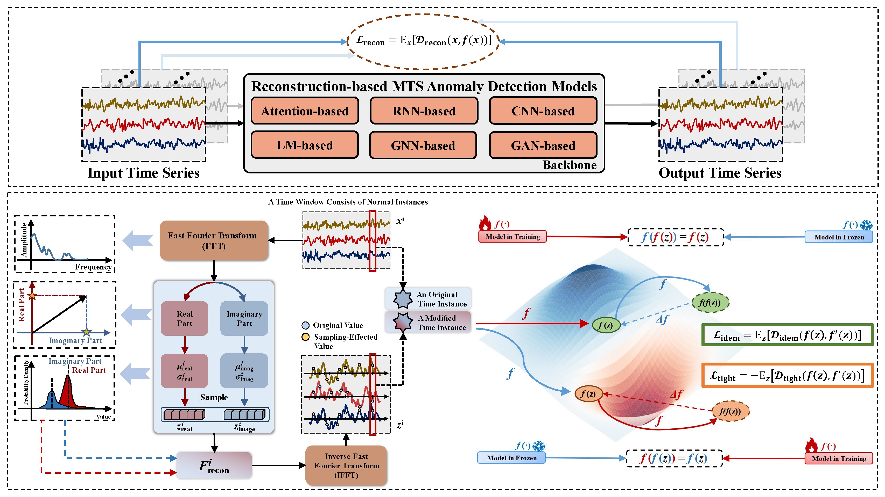

<h1 align="center">Multivariate Time Series Anomaly Detection with Idempotent Reconstruction [NeurIPS 2025]</h1>

 
  
  
  

 

The official repository for the paper "Multivariate Time Series Anomaly Detection with Idempotent Reconstruction".

Reconstruction-based methods are competitive choices for multivariate time series anomaly detection (MTS AD). However, one challenge these methods may suffer is over generalization, where abnormal inputs are also well reconstructed. In addition, balancing robustness and sensitivity is also important for final performance, as robustness ensures accurate detection in potentially noisy data, while sensitivity enables early detection of subtle anomalies. To address these problems, inspired by idempotent generative network, we take the view from the manifold and propose a novel module named **I**dempotent **G**eneration for **A**nomaly**D**etection (IGAD) which can be flexibly combined with a reconstruction-based method without introducing additional trainable parameters. We modify the manifold to make sure that normal time points can be mapped onto it while tightening it to drop out abnormal time points simultaneously. Regarding the latest findings of AD metrics, we evaluated IGAD on various methods with four real-world datasets, and they achieve visible improvements in VUS-PR than their predecessors, demonstrating the effective potential of IGAD for further improvements in MTS AD tasks.

